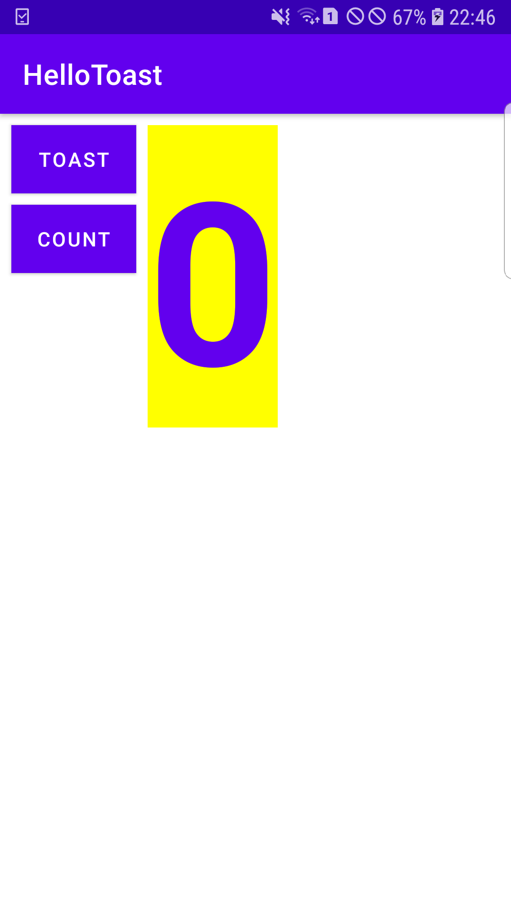
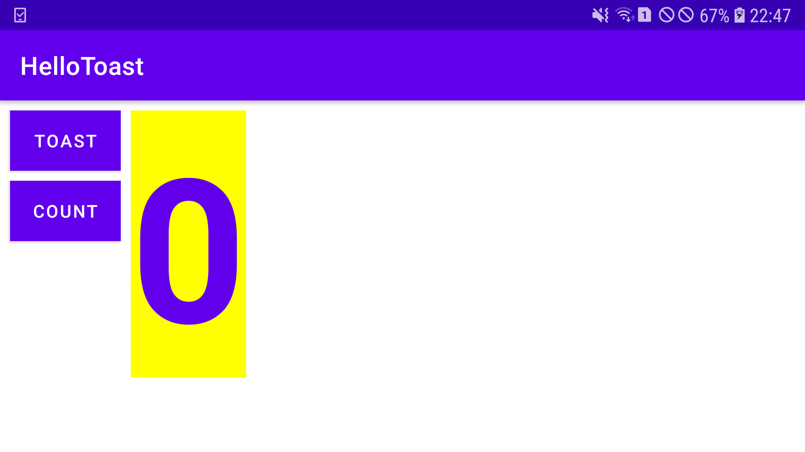
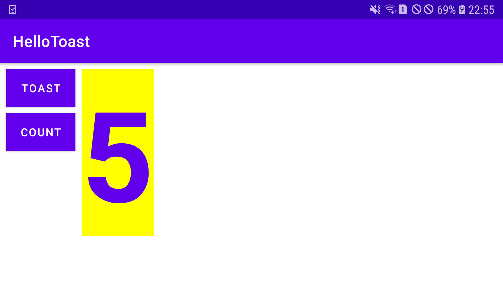

# Lab 1: Coding Challenge

**This branch consists of the 'Coding Challenge' section for the lab 1 of DMA module. There are codes and screenshots provided
within this branch and they are given below.**

---

## The Final UI

**The screenshot above shows the final UI for the Coding Challenge section of the lab 1. It is similar to the task section and 
consists of the similar views and functionalities.**

---

## The Final UI: Landscape View

**The screenshot above shows the landscape view of the final UI for the coding challenge section of lab 1 displayed in
landscape mode of a physical device.**

---

## Count Feature

**The screenshot above shows the counter feature being executed properly in the physical device.**